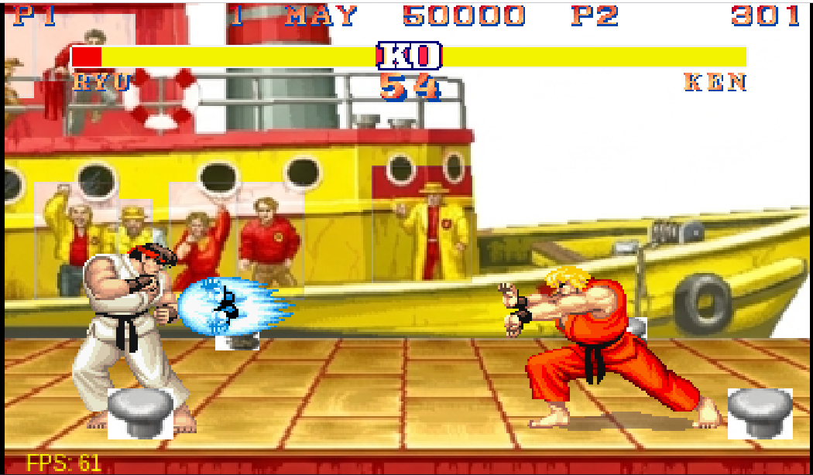
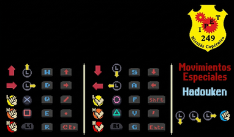

# Street Fighter

Puedes acceder a la versión del juego en línea a través del siguiente enlace: [Juego Street Fighter](https://profemoishe.github.io/SF/))

Esta versión en línea te permite jugar directamente en tu navegador web sin necesidad de descargas ni instalaciones. ¡Disfruta la emoción de las peleas clásicas estilo arcade directamente desde tu dispositivo!



## Descripción General del Proyecto

Este proyecto es un juego simple de Street Fighter desarrollado con JavaScript y el canvas de HTML5. Cuenta con personajes clásicos como Ryu y Ken, además de diversos efectos de sonido y escenarios.

## Controles del Juego

Los controles del juego son los siguientes:



### Jugador 1:

- **Movimiento**:
  - Teclado: Teclas de dirección (Izquierda, Derecha, Arriba, Abajo)
  - Mando / Gamepad: Palanca izquierda (Thumbstick)

- **Ataques**:
  - Puño Débil: Q (Teclado) / X (Mando)
  - Puño Medio: E (Teclado) / Cuadrado (Mando)
  - Puño Fuerte: R (Teclado) / L1 (Mando)
  - Patada Débil: F (Teclado) / Círculo (Mando)
  - Patada Media: V (Teclado) / Triángulo (Mando)
  - Patada Fuerte: G (Teclado) / R1 (Mando)

### Jugador 2:

- **Movimiento**:
  - Teclado: Teclas WASD (W para Arriba)
  - Mando / Gamepad: Palanca izquierda (Thumbstick)

- **Ataques**:
  - Puño Débil: Barra diagonal / Slash (Teclado) / X (Mando)
  - Puño Medio: Control Derecho / ControlRight (Teclado) / Cuadrado (Mando)
  - Puño Fuerte: Punto (Teclado) / L1 (Mando)
  - Patada Débil: Shift Derecho / ShiftRight (Teclado) / Círculo (Mando)
  - Patada Media: Comilla / Quote (Teclado) / Triángulo (Mando)
  - Patada Fuerte: Enter (Teclado) / R1 (Mando)

Toma en cuenta que en la configuración de mandos, la palanca izquierda también funciona para controlar el movimiento.

## Cómo Empezar

Para comenzar a usar este proyecto, sigue estos pasos:

1. Clona el repositorio:
   ```bash
   git clone https://github.com/Mayank-Jain-1/StreetFighter
   ```
2. Abre el archivo `index.html` en tu navegador web preferido.

¡Y eso es todo! Ya deberías poder jugar Street Fighter directamente en tu navegador.

---

## Entendiendo la Lógica del Juego

1. ### BattleScene.js

El archivo `BattleScene.js` contiene la implementación de la clase `BattleScene`, la cual representa la escena donde se lleva a cabo el combate entre los peleadores. Esta clase gestiona varios aspectos de la escena de pelea, incluyendo el manejo de los peleadores, el control de la cámara, la animación y el estado general del juego.

#### Descripción General

- **Gestión de Peleadores**: Administra la inicialización, actualización y renderizado de las entidades de los peleadores en la escena de batalla. Procesa los comandos del jugador, las interacciones entre peleadores y las transiciones de estado durante la pelea.

- **Control de Cámara**: Controla el movimiento y enfoque de la cámara dentro de la escena para asegurar que ambos peleadores permanezcan visibles durante la partida. Proporciona transiciones de cámara fluidas y sigue los movimientos de los peleadores.

- **Animación y Efectos**: Controla las animaciones de los peleadores, efectos de impacto y otros elementos visuales como sombras y superposiciones (overlays) para ofrecer una experiencia de batalla dinámica e interactiva.

- **Gestión del Estado del Juego**: Controla el estado general del juego, incluyendo los puntos de vida de los peleadores, las condiciones de victoria y las transiciones entre escenas (como la pantalla de inicio y de fin de juego).

#### Componentes Clave

- **Entidades de Peleadores**: Inicializa y gestiona las entidades de los peleadores según la selección del jugador y el estado del juego. Controla sus animaciones, ataques, colisiones e interacciones con el entorno.

- **Cámara**: Controla la posición y el movimiento de la cámara para mantener a ambos peleadores en pantalla durante las peleas. Permite un seguimiento fluido de sus movimientos para una vista más dinámica.

- **Efectos de Impacto**: Gestiona efectos como destellos/salpicaduras y temblor de pantalla para dar retroalimentación visual cuando un peleador conecta un golpe o recibe daño.

- **Estado del Juego**: Rastrea el estado de la partida, incluyendo puntos de vida, condiciones de victoria y cambios de escena. Asegura una lógica de juego constante a lo largo de la pelea.

#### Modo de Uso

Para usar la clase `BattleScene` en tu juego:

1. Importa la clase `BattleScene` desde el archivo `BattleScene.js`.
2. Inicializa una instancia de la clase `BattleScene` dentro del sistema de gestión de escenas de tu juego.
3. Integra la lectura de comandos de los jugadores para controlar las acciones y movimientos de los peleadores.
4. Implementa la detección de colisiones e impactos para determinar el resultado de los ataques e interacciones.
5. Personaliza los efectos visuales, el comportamiento de la cámara y la gestión del estado según los requerimientos y mecánicas de tu proyecto.

#### Ejemplo

```javascript
import { BattleScene } from './BattleScene.js';

// Inicializar la escena de batalla
const battleScene = new BattleScene(changeScene);

// Bucle principal del juego (Game Loop)
function gameLoop() {
	// Actualizar la escena de batalla
	battleScene.update(time);

	// Dibujar la escena de batalla
	battleScene.draw(context);
}
```

#### Notas

- Asegúrate de integrar correctamente la clase `BattleScene` dentro del sistema de gestión de escenas de tu juego y de actualizarla/renderizarla dentro del bucle principal.
- Personaliza la clase `BattleScene` según sea necesario para agregar nuevas funciones, optimizar el rendimiento y mejorar la experiencia de juego.
- Consulta los comentarios y la documentación dentro de `BattleScene.js` para ver explicaciones detalladas sobre sus métodos, propiedades y guías de uso.

---

2. ### Fighter.js

Este archivo contiene la implementación de la clase `Fighter`, la cual representa a un personaje peleador en el juego. La clase maneja varios aspectos de su comportamiento, incluyendo movimiento, ataques, colisiones, animaciones y transiciones de estado.

#### Descripción General

- **Manejo de Comandos**: La clase del peleador escucha las acciones del jugador a través de un manejador de entradas (input handler) y responde en consecuencia ejecutando acciones como moverse, saltar, agacharse y atacar.

- **Animación**: Administra las animaciones del peleador, incluyendo las transiciones entre estados como reposo (idle), caminar, saltar y atacar. Los fotogramas de animación se gestionan en base a tiempos y estados predefinidos.

- **Detección de Colisiones**: Detecta las colisiones con el peleador oponente para determinar si los ataques conectan con éxito o si los personajes chocan al moverse.

- **Gestión de Estados**: Mantiene el estado actual del peleador, lo que determina su comportamiento y acciones en cada momento. Los estados incluyen reposo, caminar, saltar, agacharse y varios estados de ataque con diferentes niveles de intensidad.

- **Efectos de Sonido**: La clase se encarga de reproducir los efectos de sonido de ataques, golpes y caídas para brindar retroalimentación auditiva durante la partida.

#### Componentes Clave

- **Velocidad y Posición**: Rastrea la velocidad y posición del peleador en el mundo del juego, permitiendo un movimiento fluido e interacción con el entorno y otros personajes.

- **Manejo de Animaciones**: Gestiona los fotogramas y tiempos de animación, garantizando transiciones suaves entre estados y ofreciendo respuestas visuales claras al jugador.

- **Detección de Ataques**: Detecta si un ataque hacia el oponente fue exitoso mediante la comprobación de colisiones, activando los efectos de impacto y cálculos de daño correspondientes.

- **Transiciones de Estado**: Controla los cambios de estado según las entradas del jugador, eventos del juego y condiciones predefinidas, garantizando un comportamiento reactivo y dinámico del peleador.

- **Detección de Colisiones**: Detecta colisiones entre los peleadores y el entorno (como los límites del escenario) para evitar atravesar objetos y asegurar un juego justo.

#### Modo de Uso

Para usar la clase `Fighter` en tu juego:

1. Importa la clase `Fighter` desde el archivo `Fighter.js`.
2. Inicializa instancias de la clase `Fighter` para cada personaje jugable.
3. Implementa el control de comandos para gestionar las acciones del peleador.
4. Integra la detección de colisiones para determinar el impacto de los ataques e interacciones.
5. Gestiona las animaciones y estados para ofrecer retroalimentación visual y crear una jugabilidad atractiva.

#### Ejemplo

```javascript
import { Fighter } from './Fighter.js';

// Inicializar peleador del Jugador 1
const player1Fighter = new Fighter(player1Id, onAttackHit, entityList);

// Inicializar peleador del Jugador 2
const player2Fighter = new Fighter(player2Id, onAttackHit, entityList);

// Bucle principal del juego (Game Loop)
function gameLoop() {
	// Actualizar peleador del Jugador 1
	player1Fighter.update(time, camera);

	// Actualizar peleador del Jugador 2
	player2Fighter.update(time, camera);

	// Renderizar peleadores
	player1Fighter.draw(context, camera);
	player2Fighter.draw(context, camera);
}
```

#### Notas

- Asegúrate de instanciar y actualizar la clase `Fighter` dentro del bucle principal de tu juego para mantener el funcionamiento correcto y la sincronización con el estado global.
- Personaliza la clase `Fighter` según lo requiera tu juego, ya sea añadiendo nuevos estados, acciones o animaciones.

Para obtener más información sobre la implementación y el uso de la clase `Fighter`, consulta los comentarios dentro del archivo `Fighter.js`.

---

3. ### ControlHistory.js

El archivo `ControlHistory.js` implementa la clase `ControlHistory`, la cual gestiona el historial de comandos ejecutados por el jugador durante la partida. Rastrea la secuencia de botones y movimientos de dirección ingresados por el usuario para detectar movimientos especiales basados en secuencias predefinidas.

#### Descripción General

- **Rastreo de Comandos**: Registra el historial de comandos del jugador (botones y direcciones) para identificar combos y ataques especiales en tiempo real.

- **Mapeo de Botones**: Asocia los controles del jugador a entradas de botones y direcciones específicas definidas en los ajustes de configuración del juego.

- **Detección de Movimientos Especiales**: Detecta ataques especiales ejecutados por el jugador al coincidir las secuencias ingresadas con las preestablecidas. Cambia el estado del peleador cuando se realiza una combinación con éxito.

#### Componentes Clave

- **Gestión del Historial**: Mantiene el registro de comandos como una lista de eventos, manejando la adición y eliminación de entradas en función de límites de tiempo y frecuencias de muestreo.

- **Mapeo de Botones**: Mapea funciones del juego a botones específicos, ofreciendo flexibilidad para configurar los controles a distintas acciones.

- **Detección de Movimientos Especiales**: Compara el historial reciente de comandos con secuencias predefinidas. Cuando detecta un combo válido, activa el estado especial correspondiente en el peleador.

#### Modo de Uso

Para usar la clase `ControlHistory` en tu juego:

1. Importa la clase `ControlHistory` desde el archivo `ControlHistory.js`.
2. Inicializa una instancia de `ControlHistory` para cada peleador.
3. Integra la captura de comandos para registrar las entradas del jugador durante el juego.
4. Implementa la lógica de detección de movimientos especiales para validar las secuencias y activar los cambios de estado requeridos.

#### Ejemplo

```javascript
import { ControlHistory } from './ControlHistory.js';

// Inicializar el historial de controles para un peleador
const controlHistory = new ControlHistory(fighter);

// Bucle principal del juego (Game Loop)
function gameLoop() {
	// Actualizar el historial de controles
	controlHistory.update(time);
}
```

---

4. ### Camera.js

El archivo `Camera.js` implementa la clase `Camera`, que representa la cámara del área de visión (viewport) utilizada para controlar qué parte del escenario se muestra en pantalla. Ajusta dinámicamente su posición según la distancia y movimiento de los peleadores para no perderlos de vista.

#### Descripción General

- **Control de Viewport**: Administra la posición de la cámara dentro del mapa para mostrar la sección adecuada al jugador. Se ajusta en tiempo real según la ubicación de ambos combatientes.

- **Comportamiento de Desplazamiento (Scrolling)**: Desplaza la vista horizontal y verticalmente al ritmo de los personajes mientras se mueven por el escenario, logrando un seguimiento fluido sin salir de los límites visibles.

#### Componentes Clave

- **Gestión de Posición**: Mantiene las coordenadas X e Y de la cámara y las actualiza para mantener el encuadre centrado entre ambos peleadores.

- **Lógica de Desplazamiento**: Ajusta el enfoque de la cámara para seguir suavemente el movimiento de los personajes y ofrecer la mejor perspectiva posible del combate.

- **Límites de Escenario**: Aplica restricciones para evitar que la cámara muestre áreas fuera del escenario o mapa de juego.

#### Modo de Uso

Para usar la clase `Camera` en tu juego:

1. Importa la clase `Camera` desde el archivo `Camera.js`.
2. Inicializa una instancia de `Camera` pasando sus coordenadas iniciales y la referencia al arreglo de peleadores.
3. Incluye la actualización de la cámara dentro del bucle de tu juego para mantener la sincronización con el movimiento de los personajes.

#### Ejemplo

```javascript
import { Camera } from './Camera.js';

// Inicializar la cámara con su posición inicial y el arreglo de peleadores
const camera = new Camera(initialX, initialY, fighters);

// Bucle principal del juego (Game Loop)
function gameLoop() {
	// Actualizar la posición de la cámara
	camera.update(time, context);
}
```

#### Notas

- Personaliza la clase `Camera` si necesitas añadir funciones como zoom, efectos de sacudida o redimensionamiento dinámico de pantalla.
- Asegúrate de actualizar la cámara en el bucle principal del juego para garantizar una respuesta fluida en tiempo real.
- Consulta las explicaciones adicionales dentro del archivo `Camera.js` para conocer más detalles sobre sus métodos y propiedades.

---

## Recursos Utilizados para el Desarrollo del Juego

Durante la creación del juego se utilizaron los siguientes sitios web y herramientas para la creación, edición de sprites y obtención de audio:

1. **GraphicsGale**:
   - **Descripción**: Editor gráfico versátil enfocado principalmente en la creación y edición de sprites, animaciones y pixel art.
   - **Uso**: Se usó ampliamente a lo largo del desarrollo para diseñar y detallar los gráficos de los sprites, animaciones de personajes, fondos y efectos visuales.

2. **The Spriters Resource** (https://www.spriters-resource.com/):
   - **Descripción**: Biblioteca en línea de hojas de sprites (sprite sheets), gráficos y recursos de arte extraídos de diversos videojuegos.
   - **Uso**: Sirvió como una fuente clave para obtener hojas de sprites y gráficos que se adaptaron e integraron en las mecánicas del juego.

3. **The Sounds Resource** (https://www.sounds-resource.com/):
   - **Descripción**: Plataforma con una colección masiva de efectos de sonido, pistas de música y clips de audio de diversos títulos.
   - **Uso**: Se utilizó para obtener los efectos de sonido, música de fondo y otros elementos de audio para enriquecer la experiencia sonora de las batallas.

4. **Referencia de YouTube** (https://www.youtube.com/@shezzor):
   - Agradecimiento especial a @shezzor, cuya lista de reproducción en YouTube sobre desarrollo en JS sirvió como excelente guía de aprendizaje para este proyecto.

Gracias al uso de estos recursos, el proyecto cuenta con un apartado visual y sonoro de gran calidad, logrando una experiencia de juego más inmersiva.

## Forks Interesantes de la Comunidad para Revisar
1. @vm10k - https://github.com/vm10k/SFA-Multiplayer

## Contribuciones

Si te interesa contribuir a este proyecto, siéntete libre de abrir un *issue* o enviar un *pull request*. ¡Cualquier aportación es bienvenida!

## Licencia

Este proyecto se encuentra bajo la [Licencia MIT](LICENSE).

---

¡Siéntete libre de actualizar este README conforme el proyecto siga evolucionando!
